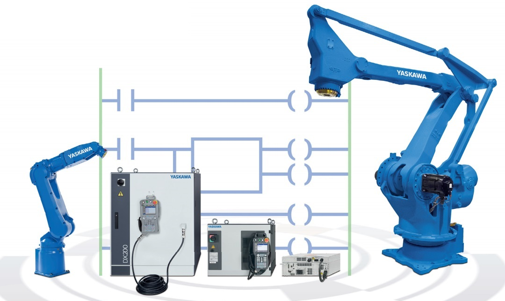

  

<h1 align="center">
  MotoLogix examples
</h1>

<em>
  Let's speedup the implementation of MotoLogix into your projects by using
  library functions and application sample code built by the community.
</em>

## About

In this repository we join forces to build the next generation of example
programs for [MotoLogix](https://motologix.yaskawa.eu.com) together.

The idea behind this is that rather than just expecting the variety of users
to use the examples as Yaskawa designed them, we ask the users to bring in their
ideas and requirements.

This can happen in the form of [discussions](/discussions) but maybe you also
want to get your hands dirty on coding and/or testing.

## Goals

With the first generation of example programs (e.g. `6_PosTable`) we achieved
these goals:

- **Flexible** - Trajectories created with data, not PLC logic.
- **Robust** - Ability to continue the trajectory after any error.
- **Low on CPU resources** - Trimmed data types, re-using FB instances
  (mapped instructions).

While sticking to these goals we add a few more for the next generation of
example programs:

- **Scalable** - Whether you are using just a *single robot* for pick and place
  or having *multiple robots on a linear track* serving many stations,
  the MotoLogix examples should get you covered.
- **Easier implementation** - Adding an additional robot should a matter of
  minutes, not hours. This can be achieved by wrapping the program code into
  reusable library functions.
- **Uniform code** - Applying a programming style guide will help to make the
  code more uniform and improve its readability.
- **Feature rich** - By implementing more (and new) MotoLogix functions we can
  better utilize the full feature set of MotoLogix.

## Development environment

We use **Codesys** as the development platform of choice.
Codesys comes with good `IEC 61131` support, a modern IDE and doesn't require
large investments. In fact, we will use the Codesys Runtime for Raspberry Pi.

*That's right, we're gonna use a Raspberry Pi 4 and Codesys to control the
robot.*

Besides being really low-cost and having good performance, the *Codesys Runtime
for Raspberry Pi* has many field bus masters on board (without additional
costs).
It means that it can be used with EtherCAT, PROFINET, EtherNet/IP and more.
Thanks to that flexibility we don't require a strict configuration of the
robot controller.
It doesn't matter whether your robot system is equipped with
a PROFINET board or any of the other field buses, the PLC just adapts to your
system.

## Library development

Once the functions reach a mature stage a library will be released.
This Examples library as a whole will then be ported to the other PLC platforms
which support MotoLogix.

It would be a waste of resources to develop a function at many platforms at the
same time. Therefore we distinguish between *development* and *porting* and use
the following order:

1. **Development** of a function on Codesys.
1. **Testing** the function on Codesys.
1. **Release** the Examples library for Codesys when a certain set of functions
   is ready.
1. **Port** the library to the other platforms.

### But I'm using Siemens TIA, what should I do with Codesys logic?

If a certain function is already ready and tested (so after finishing
above mentioned step 2), you might not want to wait for the library release for
your platform. In that case, you can decide to port its code yourself.

Then, if you are willing to share your ported (and tested) code anyone could
benefit. This remains your own choice of course.

### Porting between platforms

Porting *Structured Text* (ST, or SCL) code between PLC platforms is usually not
so problematic.
From our experience with porting the MotoLogix library more than 90% of the
code can be ported by plain *copy-pasting*.

It's the platform specific functions (e.g. `memcpy` vs `blkmov`) which require
some editing afterwards. But once you know the syntax, these tasks can often be
semi-automated using an editor with good *find and replace* functions
(using *regex*).
