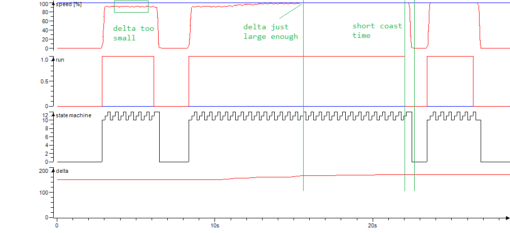



Endless motion is an *option function* which can be applied to external axes
(e.g. `S1`) and in some cases also for selected manipulator axes
(e.g. `T-axis`).

MotoLogix does not have native support for axes with endless motion.
However, by sending a series of relative motion commands we can add some of the
functionality ourselves.

## Library components





## Option function setting

The option function has to be set by Yaskawa.


| item             | value                      |
| ---------------- | -------------------------- |
| ENDLESS FUNCTION | `STANDARD`<br>~~`AUTO-RESET`~~ |

- **AUTO-RESET** automatically resets the axis position to keep it in the range
  of -180 to 180 deg. This automatic reset however has an effect on the motion.
  It will slow down at every reset point. This makes this setting **not suitable**
  for our use case.
- **STANDARD** does not automatically reset the axis position. It also allows
  larger relative motion distances which makes it suitable for even very high
  speeds of axes with small gear ratios.
  But since the axis position is never reset, absolute positioning is not so
  comfortable (e.g. moving to absolute 90 deg could lead to rotating many
  revolutions).
  A workaround for this would be to use a small INFORM job to run the `MRESET`
  command.

For our use case we need the **STANDARD** setting.

## How it works

A small state machine handles three instances of the relative
axis motion command (`MLxRobotMoveAxisRelative`).

- As long as motion is requested (`directions[0] <> 0`), the state machine starts
  looping in state `10/11/12` and initiating incremental motion commands.
- When motion is no longer requested (`directions[0] = 0`) the state machine will
  keep looping until all pre-sent motions are finished and then return to the
  idle state.
  The time this takes (*coast time*) depends on the combination of `speed`
  and `delta`.
  For a good user experience, the coast time should be as short as possible.
  This can be achieved by optimizing the `delta` parameter.

It uses the principle where each state has a *primary motion* and sends up to
*two motions in advance*.
This way the robot controller always has the required three motions (for
smooth blending) in its motion queue.

```iecst
//start this motion
moveCmd[0].Enable := TRUE;

//queue next 2 motions
moveCmd[1].Enable := (moveCmd[0].Sts_EN AND moveCmd[0].Sts_DN) AND (QA >= 1);
moveCmd[2].Enable := (moveCmd[1].Sts_EN AND moveCmd[1].Sts_DN) AND (QA >= 2);
```

- By using the `Sts_DN` of the preceding command the commands are
  sent nicely after each other.

- The `QA` variable (*Queueing Amount*) is used as mechanism to work towards
  a standstill.
  In such case the state machine should no longer keep sending motions in
  advance but it should still handle the already sent motions.

The QA is being recalculated at every transition between these three states.
A transition takes place when the primary motion is finished (`Sts_PC`).

```iecst
IF moveCmd[0].Sts_EN AND moveCmd[0].Sts_PC THEN
  moveCmd[0].Enable := FALSE;
  // calc QA
  IF run THEN
    QA := QAmax; // no standstill foreseen
  ELSE
    QA := QA - 1; // planning towards standstill
  END_IF;
  IF (QA >= 0) THEN
    state := 11;
  ELSE
    state := 0;
  END_IF;
END_IF;
```

## Optimizing the `delta` parameter

Ideally, the `delta` parameter (per axis) for a given speed should be:

- As large as needed to achieve a constant motion which runs at the set speed.
- As small as possible to achieve the shortest coast time.

As there is a linear relation between the `speed` and the required
`delta`, the solution is to determine the delta at a very low speed (e.g. `0.5%`)
and very high speed (e.g. `30%`):

The required delta depends on various factors such as the *system latency*
(PLC task, fieldbus) and the *type of axis*.
To determine the required delta for an axis the following steps apply:

### 1) Configure feedback data for reading axis speed

The axis speed is not available by default but we can set it easily:

1. Trigger `MLxRobotGetProperties` to read the controller properties.
1. Set `MLX.Robot[].RobotAxes[].ConfigurationData.FeedbackUserDataTyp = 2`
   for each axis you want to monitor.
1. Trigger `MLxRobotSetProperties` to write the new settings.

Now the axis speed is returned cyclically in the data packet.


This needs to be repeated after every restart of the robot controller.

### 2) Create a trace

This trace should have at least the following signals:

- State machine: `state` variable.
- Run command: `direction[0]` parameter (or the internal `run` variable).
- Set speed: `speed` parameter (in %).
- Actual speed: `MLX.Robot[].RobotAxes[].FeedbackData.UserData` (in deg/s).
  Or, for better comparison, converted to %:

  ```iecst
  actSpeed := 100 * 
              ABS( MLX.Robot[].RobotAxes[].FeedbackData.UserData / <maximum axis speed> );
  ```

  The maximum axis speed can be found in the *specification/flyer* (in case of
  a manipulator) or determined from the *robot settings* (in case of an external
  axis).

### 3) Adjust delta

By observing the trace while carefully moving an axis, you can adjust `delta` to
find the optimal value:

- Axis speed same as setpoint.
- Short coast time.



### todo


