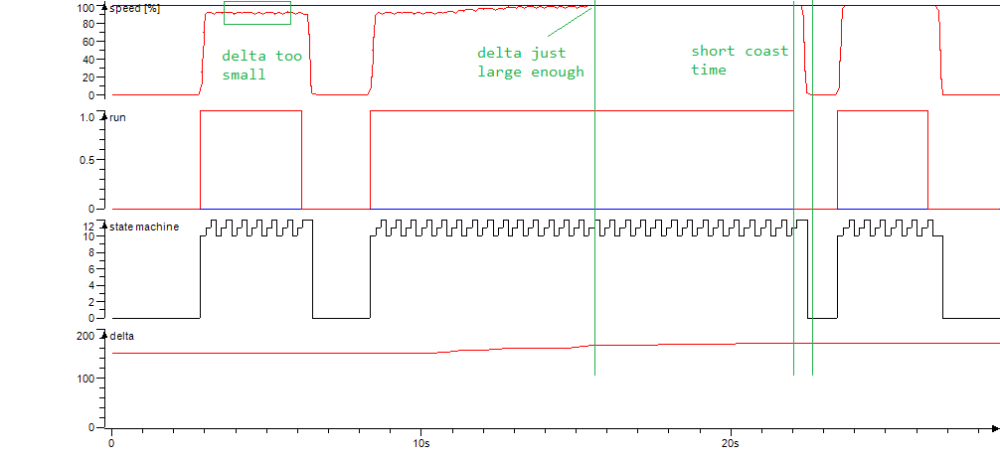



The deltas at *low* and *high* speed have to be determined once for each axis,
type of motion device (e.g. GP12 manipulator, S-axis) and type of motion
(axis/TCP).
This is done using the [procedures](#determining-the-deltas) described in this article.

Once the deltas for a motion device have been determined, we can use them for
any given speed by scaling them with .


The required deltas depend on various factors such as the *system latency*
(PLC task, fieldbus) and the *type of axis*.


## Ideal delta values

Ideally, the delta per axis for a given speed should be:

1. As large as needed to achieve a constant motion which runs at the set speed.
1. As small as possible to achieve the shortest coast time.

As there is a linear relation between the speed and the required
delta, the solution is to determine the delta at a low speed (e.g. `0.5%`)
and high speed (e.g. `30%`).

Running  or 
without optimized deltas can lead to the following situations:

- **Delta too low:** Motion cannot reach higher speeds.
- **Delta too high:** Motion has a longer coast time.
  This can potentially lead to dangerous situations and/or collisions as the
  motion device does not stop as quick as expected.


If you need to run relative motions but haven't been able to determine the
delta values yet it is better to stay on the safe side and keep the values low.


## How deltas are used

To answer this we need to know how the `MceRelative...Motions`
functions work.

When such a function is started (e.g. pressing the jog button) it will
start feeding the robot controller with short relative motion commands.
It is using up to three instances so that motions can blend nicely.

This means that at the time of stopping the function (e.g. releasing the
jog button), there can still be up to three buffered motions which need to be
finished.
The time this takes is called the *coasting time* and this should always be as
short as possible.

Example: If the delta for a certain axis is set to 15 degrees, the coasting
could take up to 45 degrees (three buffered motions of 15 degrees).

## Determining the deltas

- Use the same PLC task setting every time you are determining deltas for a
  type of motion device.
- By strictly applying this rule the motion devices can
  be swapped easily in the future.


Recommended PLC task setting: `2ms`


Don't worry about the PLC task time in the final application: The
 input of the scaling function
can be used to adjust the deltas.

### Axis motion deltas

Procedure for determining the deltas for relative
 motion:

#### 1) Configure feedback data for reading axis speed

The axis speed is not available by default but we can set it easily:

1. Run `MLxRobotGetProperties` once to read the controller properties.
1. Set `MLX.Robot[].RobotAxes[].ConfigurationData.FeedbackUserDataTyp = 2`
   for each axis you want to monitor.
1. Run `MLxRobotSetProperties` once to write the new settings.

Now the axis speed is returned cyclically in the data packet.


This needs to be repeated after each controller restart.


#### 2) Create a trace

This trace should have at least the following signals:

- State machine: `nSmMotions` variable.
- Run command: internal `bRun` variable.
- Set speed: `fSpeed` variable (in %).
- Actual speed: `MLX.Robot[].RobotAxes[].FeedbackData.UserData` (in deg/s).
  Or, for better comparison, converted to %:

  ```iecst
  fActSpeed :=
    100 *
    ABS( MLX.Robot[].RobotAxes[].FeedbackData.UserData / <maximum axis speed> );
  ```

  The maximum axis speed can be found in the *specification/flyer* (in case of
  a manipulator) or determined from the *robot settings* (in case of an external
  axis).

#### 3) Adjust delta

By observing the trace while carefully moving an axis, you can adjust `delta` to
find the optimal value:

- Axis speed matches the set speed
- Short coast time




### TCP motion deltas

Procedure for determining the deltas for relative
 motion:

Todo
