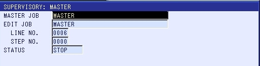

There might be situations where you want to run an INFORM job on
the robot controller. For example, because the desired feature is not yet
available as native MotoLogix function.

For this purpose, we have defined a small (1 byte) interface, which we embed
in the 8 byte `DigitalInputs` / `DigitalOutputs` of the MotoLogix data packet.
This means that there is no additional data packet required.

The `MceRunInformJob` function interacts with the robot controller through this
interface, using a ,
a  and two state machines
( and
).

**Co-existence of MotoLogix and INFORM**<br>
MotoLogix and INFORM are in fact two different worlds, and the robot controller
can only process one of them at a time.
This means it is not possible to start an INFORM job while MotoLogix motions are
active.

Only after the MotoLogix motions have finished
(and `MLX.systemState` has returned to `3-idle`), the INFORM job can be started.
This is interlocked inside the `MceRunInformJob` function.

For the other way around, the same applies; Only after the INFORM job has
finished, the MotoLogix motions can be started. This has to be interlocked by the
user. The `MceRunInformJob` function informs the user when the INFORM job is
finished by its `io.bDone` signal.

**Pausing an INFORM job**<br>
The regular MotoLogix *hold* function does not work for INFORM jobs. Therefore we
implemented a hold function in this job interface.
A rising edge of the `io.bHoldRestart` input allows to hold or restart the
active INFORM job at any time, with the  `io.bHoldActive` output informing about
the hold state.

Besides the `io.bHoldRestart` input, you can also use the white *hold* button
and green *start* button on the Yaskawa classic pendant for hold and restart.

Sometimes, the restart from a hold situation fails, for unknown reasons.
In this case the state machine handling hold/restart (`io.nSmHold`) immediately
returns to state `20-hold active`.
Trying restart a second time usually solves it.

**Robot setup**<br>
To use this INFORM job interface, some custom CIO mapping and INFORM jobs must be
setup in the robot controller.
This is described in the [robot setup](#robot-setup) below.

## Robot setup

> [!IMPORTANT]
> Without this robot setup, the `MceRunInformJob` function cannot work.

General Purpose IO used in this example (referenced ones in bold):

| I/O group  | I/O number       | Address             | Description               |
| ---------- | ---------------- | ------------------- | ------------------------- |
| IG#200     | IN#**1593**      | #**02000**          | run job                   |
| IG#200     | IN#**1594**      | #**02001**          | confirm job number        |
| IG#**201** | IN#1601 to 1604  | #**02010** to 02013 | job number (first 4 bits) |
| OG#200     | OUT#**1593**     | #**12000**          | job done                  |
| OG#**201** | OUT#1601 to 1604 | #**12010** to 12013 | job number (first 4 bits) |

### CIO

Below an example CIO for using `MceRunInformJob`, with
the job interface data mapped to the *first* byte of `DigitalInputs` / `DigitalOutputs`.

<details><summary>Read more...</summary>

> [!NOTE]
> This is *USER CIO*, to be placed in `CIOPRG.LST` between `PART 2` and `END`.

*CIO (with comments):*

```cio
// -----------------------------------------------------------------------------
// MotoLogix I/O; to PLC
// -----------------------------------------------------------------------------
// These 64 bits are mapped to the MLX[].InternalData.ReadPacket by
// the robot system software and mentioned here just for information.
// An offset can be set in robot parameter S3C1383. 
//
// .DigitalInputs[0].0                  <-      general purpose inputs                  #00010 - #00087 
// .DigitalInputs[1].31


// -----------------------------------------------------------------------------
// MotoLogix I/O; from PLC
// -----------------------------------------------------------------------------
// These 64 bits are mapped to the MLX[].InternalData.WritePacket by
// the robot system software and mentioned here just for information.
// An offset can be set in robot parameter S3C1384.
//
// .DigitalOutputs[0].0                 ->      general purpose outputs                 #10010 - #10087
// .DigitalOutputs[1].31


// -----------------------------------------------------------------------------
// overview
// -----------------------------------------------------------------------------
// | byte | PLC to Robot    | Robot to PLC    |
// | :--- | :-------------- | :-------------- |
// | 0    | MceRunInformJob | MceRunInformJob |
// | 1    | spare           | spare           |
// | 2    | spare           | spare           |
// | 3    | spare           | spare           |
// | 4    | spare           | spare           |
// | 5    | spare           | spare           |
// | 6    | spare           | spare           |
// | 7    | spare           | spare           |


// -----------------------------------------------------------------------------
// MceRunInformJob; from PLC
// -----------------------------------------------------------------------------
// copy the job number (in bit 0-3) from OG#001 to IG#201
STR #70017
WAND #10010,15,#02010

// .DigitalOutputs[0].4        ->  confirm job number (used in JOB for handshake)
STR #10014
OUT #02001

// .DigitalOutputs[0].5        -> reset MASTER job (set the cursor to the top)
STR #10015
OUT #40070

// .DigitalOutputs[0].6        ->  run MASTER job
STR #10016
OUT #40250

// .DigitalOutputs[0].6        ->  run MASTER job (used in JOB for handshake)
STR #10016
OUT #02000

// .DigitalOutputs[0].7        ->  hold MASTER job
STR #10017
OUT #40270


// -----------------------------------------------------------------------------
// MceRunInformJob; to PLC
// -----------------------------------------------------------------------------
// copy the active job number (in bit 0-3) from OG#201 to IG#001
STR #12010
OUT #00010
STR #12011
OUT #00011
STR #12012
OUT #00012
STR #12013
OUT #00013

// .DigitalInputs[0].4          <- green start button on pendant
STR #80016
OUT #00014

// .DigitalInputs[0].5          <- job idle (ready for start, with cursor at top)
STR #50020
OUT #00015

// .DigitalInputs[0].6          <- job busy
STR #50640
OUT #00016

// .DigitalInputs[0].7          <- job done (written in JOB)
STR #12000
OUT #00017
```

> [!NOTE]
> Above CIO example code is having comments for better understanding.
> When implementing, always make sure to remove comments and white lines,
> as these are **not supported** by the robot controller.

*CIO (clean):*

```cio
STR #70017
WAND #10010,15,#02010
STR #10014
OUT #02001
STR #10015
OUT #40070
STR #10016
OUT #40250
STR #10016
OUT #02000
STR #10017
OUT #40270
STR #12010
OUT #00010
STR #12011
OUT #00011
STR #12012
OUT #00012
STR #12013
OUT #00013
STR #80016
OUT #00014
STR #50020
OUT #00015
STR #50640
OUT #00016
STR #12000
OUT #00017
```

**Using a different byte**<br>
If you want to map the job interface data to a different byte, the IO addresses
must be adjusted.

For example, to use the *third byte* you would need to change inputs addresses
from `#0001x` to `#0003x` and output addresses from `#1001x` to `#1003x`.

</details>

### INFORM

Below the example INFORM jobs for using `MceRunInformJob`, consisting of one
*master* job and 16 *sub jobs*.

<details><summary>Read more...</summary>

- The `MASTER` job contains the logic for calling the request sub job and handles
  the handshaking with the state machine in the `MceRunInformJob` function.
- Each sub job can be adjusted to your needs.
  The timer is just a place holder and can be replaced by your own INFORM code.

**MASTER job**<br>

```inform
/JOB
//NAME MASTER
//POS
///NPOS 0,0,0,0,0,0
//INST
///DATE 2026/02/18 16:59
///ATTR SC,RW
///LVARS 1,1,0,0,0,0,0,0
NOP
'Reset finished
DOUT OT#(1593) OFF
'Reset job number
DOUT OG#(201) 0
'Read job number
DIN LB000 IG#(201)
'Read job number
DIN LB000 IG#(201)
'Call job
SET LI000 LB000
SWITCH LI000 CASE 0
  TIMER T=3.00
CASE 1
  CALL JOB:01
CASE 2
  CALL JOB:02
CASE 3
  CALL JOB:03
CASE 4
  CALL JOB:04
CASE 5
  CALL JOB:05
CASE 6
  CALL JOB:06
CASE 7
  CALL JOB:07
CASE 8
  CALL JOB:08
CASE 9
  CALL JOB:09
CASE 10
  CALL JOB:10
CASE 11
  CALL JOB:11
CASE 12
  CALL JOB:12
CASE 13
  CALL JOB:13
CASE 14
  CALL JOB:14
CASE 15
  CALL JOB:15
ENDSWITCH
'Set finished
DOUT OT#(1593) ON
'Wait for stopped
WAIT IN#(1593)=OFF
'Reset finished
DOUT OT#(1593) OFF
'Reset job number
DOUT OG#(201) 0
END
```

**Sub job 01..15**<br>

*Sub job 01:*

```inform
/JOB
//NAME 01
//POS
///NPOS 0,0,0,0,0,0
//INST
///DATE 2026/02/12 10:22
///ATTR SC,RW
///GROUP1 RB1
NOP
'Echo job number
DOUT OG#(201) 1
'Wait for confirmation
WAIT IN#(1594)=ON
'Edit below this line
'----------------
TIMER T=3.00
END
```

*Sub job 02:*

```inform
/JOB
//NAME 02
//POS
///NPOS 0,0,0,0,0,0
//INST
///DATE 2026/02/12 10:22
///ATTR SC,RW
///GROUP1 RB1
NOP
'Echo job number
DOUT OG#(201) 2
'Wait for confirmation
WAIT IN#(1594)=ON
'Edit below this line
'----------------
TIMER T=3.00
END
```

> [!NOTE]
> Sub job 03 to 14 not displayed to maintain readability of this page.

*Sub job 15:*

```inform
/JOB
//NAME 15
//POS
///NPOS 0,0,0,0,0,0
//INST
///DATE 2026/02/12 10:22
///ATTR SC,RW
///GROUP1 RB1
NOP
'Echo job number
DOUT OG#(201) 15
'Wait for confirmation
WAIT IN#(1594)=ON
'Edit below this line
'----------------
TIMER T=3.00
END
```

</details>

### Set master job

After all INFORM jobs are created, there is one thing left to do:
The master job must be set.

<details><summary>Read more...</summary>

*Steps:*

1. Key switch to <kbd>TEACH</kbd>
1. Menu
<kbd>job</kbd> >> <kbd>ctrl master</kbd> >> <kbd>select</kbd> >>
<kbd>setting master job</kbd>
1. Now selecting your master job.
   

</details>

</details>
