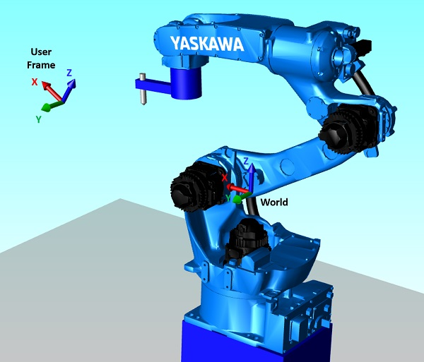

This defines a user frame as *vector* from world frame to user frame.

- Example user frame: `[700, 0, 200, 0, -45, 0]`

  | Axis | Value   |
  | ---- | ------- |
  | X    | 700 mm  |
  | Y    | 0 mm    |
  | Z    | 200 mm  |
  | Rx   | 0 deg   |
  | Ry   | -45 deg |
  | Rz   | 0 deg   |


User frames which are defined by teaching three positions (`ORG/XX/XY`) can be
transformed into a vector using *matrix calculations*.

